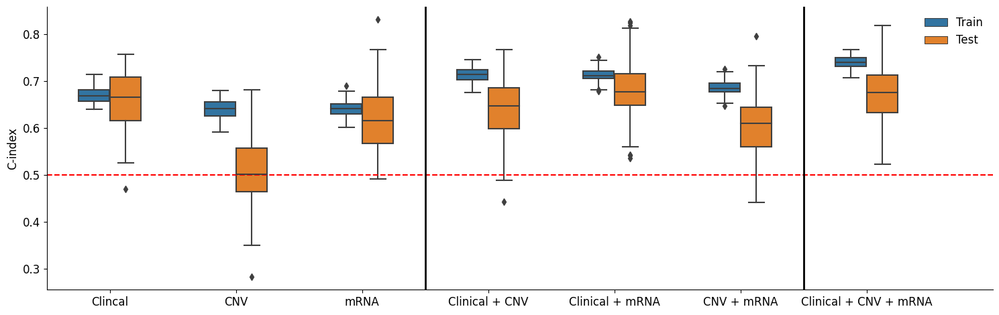

# Clinical Assessment of Genomic and Proteomic Cancer Data

This repository reproduces the results from the [paper](https://www.nature.com/articles/nbt.2940) titled **"Assessing the clinical utility of cancer genomic and proteomic data across tumor types"**. It studies the benefits of integrating molecular data like mRNA, and CNV with clinical data like age, and gender to build accurate survival models. They used 4 cancer types (GBM, KIRC, LUSC, and OV) as a starting point for their analysis.

This repository tries to reproduce some of the results of **GBM**, while discussing the differences in the applied methods to achieve those results.

## Methods

The authors used Cox Proportional Hazards and Random Survival Forest to predict patient survival. They started by splitting the data to 80% training and 20% testing to test the model.They performed a feature selection step on every type of data using a univariate cox model, then made separate models for the clinical data and different types molecular data using significant features, then, they integrated molecular data with the clinical data. This setup was repeated 100 times to assess the models' correctness. They key metric was the concordance index (C-index).

From our point of view, performing feature selection using univariate regression ignores the interaction between features and results in filtering out insignificant features in the univariate model that may have strong significance in the multivariate model. Therefore, we did not perform univariate regression except for mRNA data due to the large number of features (>17k) and the computational cost. Additionally, we added **Lasso** penalty for the *CNV* and *mRNA* data. We only tested for the Cox models.

## Results
We achieved identical results for training and testing splits for *Clinical*, *CNV*, *Clinical + CNV* data. As for *mRNA* and *Clinical + mRNA*, the training performance was less than the one mentioned in the paper while our testing performance was better. We suspect that this is due to the **Lasso** penalty.

